# Encrypt0

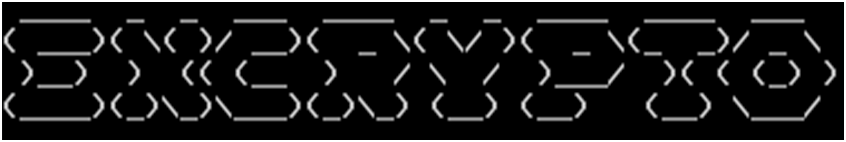

*-A tool written in Python and implemented in C for quick encryption-*

## INTRODUCTION

Encrypt0 is an application created using the Python (ver. 3.8.6) programming language. The main function it fulfils is to quickly encrypt small pieces of alphabetical text for secure transfer. The application itself provides the user options for both encrypting and decrypting data. 

The user interface of this program (UI) is console based i.e. this application provides a Text-based User Interface or Terminal User Interface (TUI). In order to ensure smooth functioning, various snippets of help texts are also displayed in the application when executed.

To know more about the application, refer to the rest of the documentation.

 
## INSTALLATION

Encrypt0 can be installed and used on devices running on both Windows and GNU/Linux-based operating systems. This application has been tested on “Windows 7 (32-bit)”, “Windows 10 (64-bit)” and “Raspbian GNU/Linux 10 (buster) (armv7l)” operating systems.

This application does not require explicit installation since it uses a frozen binary executable. System-specific instructions for running Encrypt0 are given below:

### INSTALLATION INSTRUCTIONS:

#### WINDOWS:

•	To run the application, extract the "Windows" folder from the downloaded compressed folder and store it somewhere on the device’s hard disk. *(You can use the WinRAR utility to extract the folder.)*

•	Enter the Encrypt0 folder and run “main.exe”. *(This is the executable for Encrypt0)*

•	Ideally, the application will start and you should see a terminal window open up. *(Known as “command prompt” or “cmd” on Windows.)*

•	However, there is a possibility that the .exe file is considered a malware by your antivirus software. *(Encrypt0 is not malware, its source code is available for everyone to see.)* If such a situation arises, please refer to your antivirus software’s manual to create an exception for the file “main.exe”.

#### GNU/Linux:

•	To run the application, extract the "Linux" folder from the downloaded compressed folder and store it somewhere on the device’s hard disk. *(You can use the “unzip” utility to extract the folder.)*

•	Enter the Encrypt0 folder and run “main”. *(This is the executable for Encrypt0)*

•	The application should now start and you should see a terminal window open up.

## USAGE

Encrypt0 provides an easy-to-use Text-based User Interface (TUI). 

#### IMPORTANT: In order to make sure that the applications runs without problems make sure that there is a folder called “user” in the same directory as the file “main.exe” on Windows devices or “main” on GNU/Linux-based devices.

When you execute the application, you will see the following loading screen first:

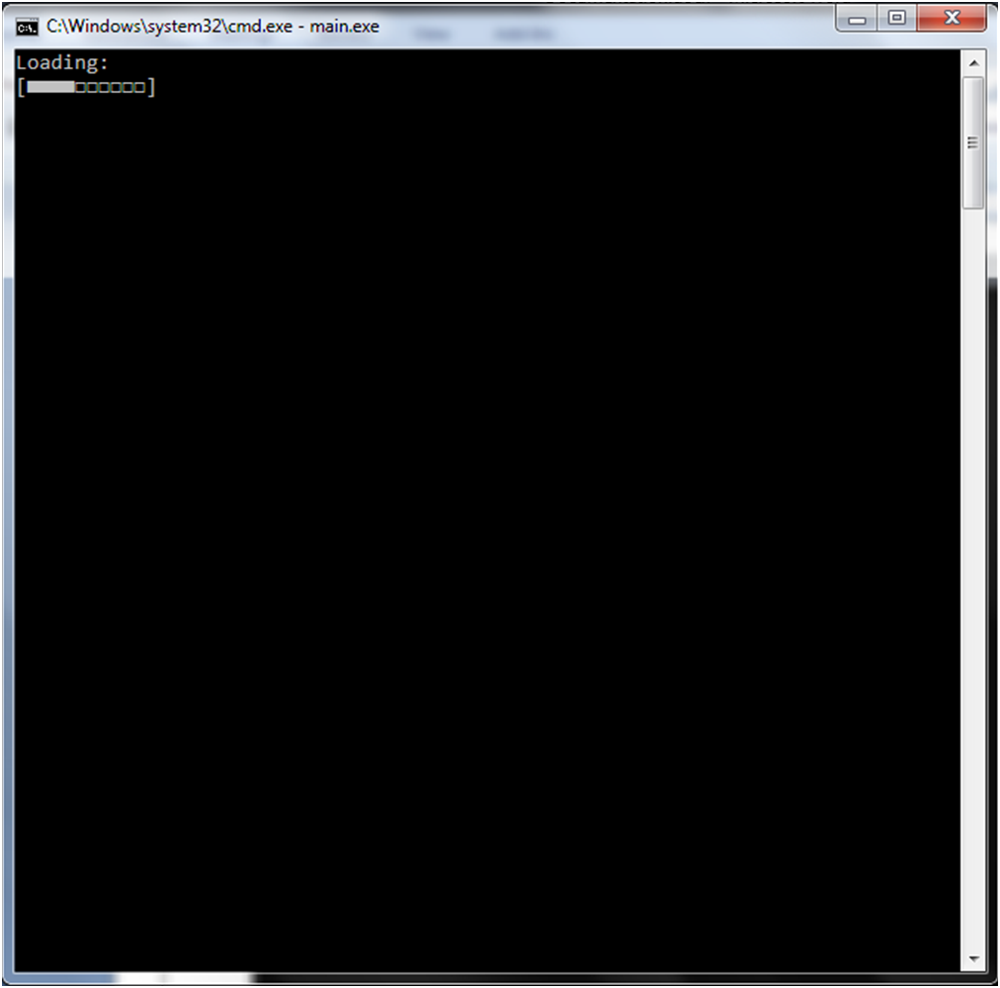

*Fig 1.1 Loading Screen*

Next, the following screen (the main dashboard) will appear:

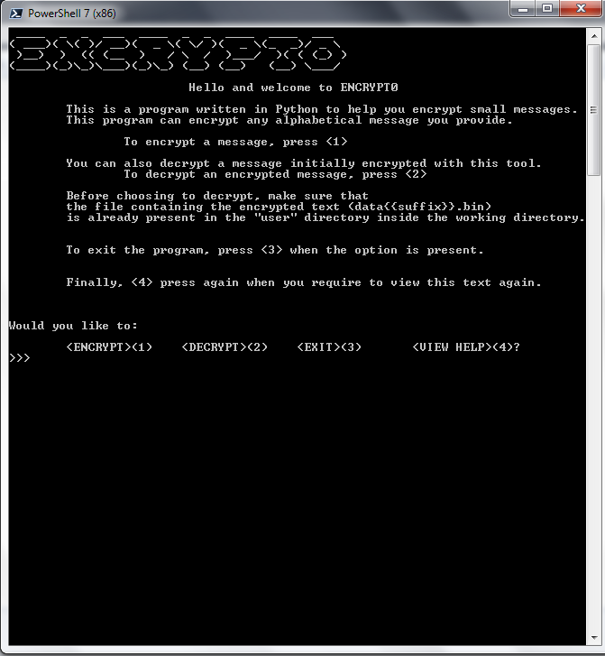

*Fig. 1.2 Main Dashboard*

**Now you are provided with various choices:**
1. **You can press “1” to encrypt a new message.**
2. **Press “2” to decrypt an existing message.**
3. **Press “3” to exit from the application.**
4. **Press “4” to view the Main Dashboard and Help Text once again.**

### I. Encrypt a new message:

When you press “1” on the main dashboard prompt, you will see the following screen after a loading screen:

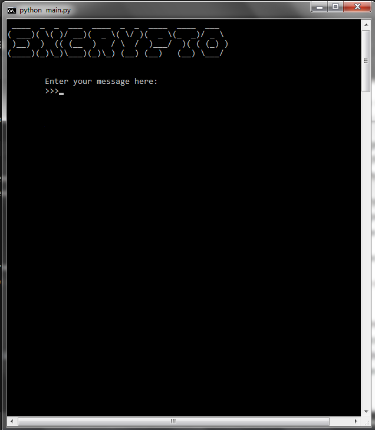

*Fig. 1.3 Encryption (Message Input)*

Now, you can enter a new message to encrypt in this prompt. (Remember, your message should only include one sentence of any length and only alphabetical characters):

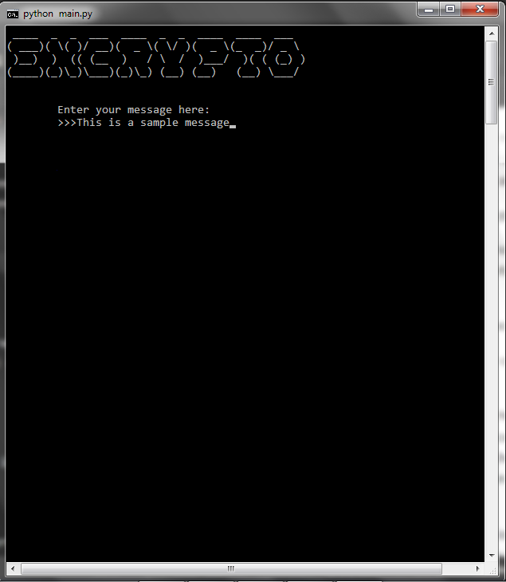

*Fig. 1.4 Sample Input (Encryption)*

However, if you type any numeric character (1, 2, 3, etc.) or special characters (“.”, “,”, “/”, “?”, etc.) except whitespace, you will see the following message:

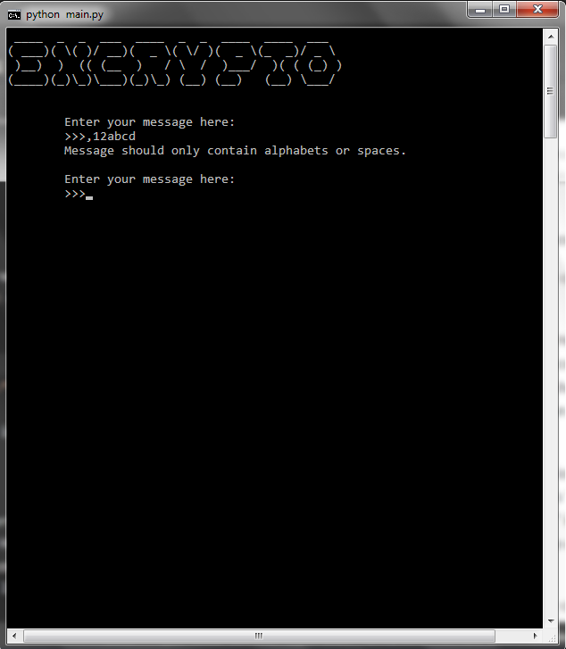

*Fig. 1.5 Encryption Input Exceptions*

After typing a syntactically correct input, you will see the following prompt:

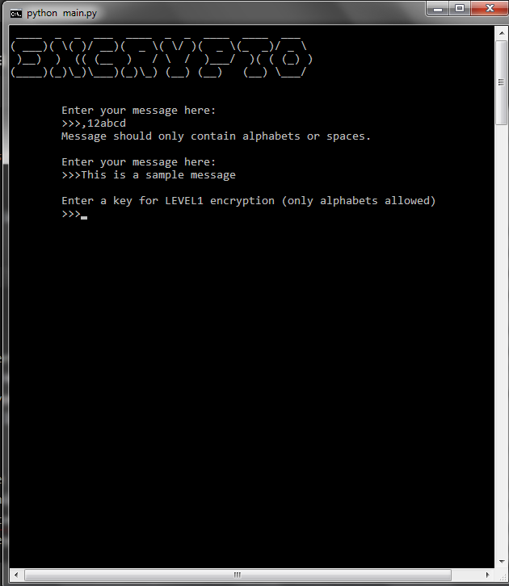

*Fig 1.6 LEVEL1 Encryption*

Here too, no special characters, numeric characters, etc. with the exception of whitespace as before are allowed. However, the LEVEL1 key should be smaller in length than the message typed earlier:
**Note: You can type whatever keys you like in both levels 1 & 2.**

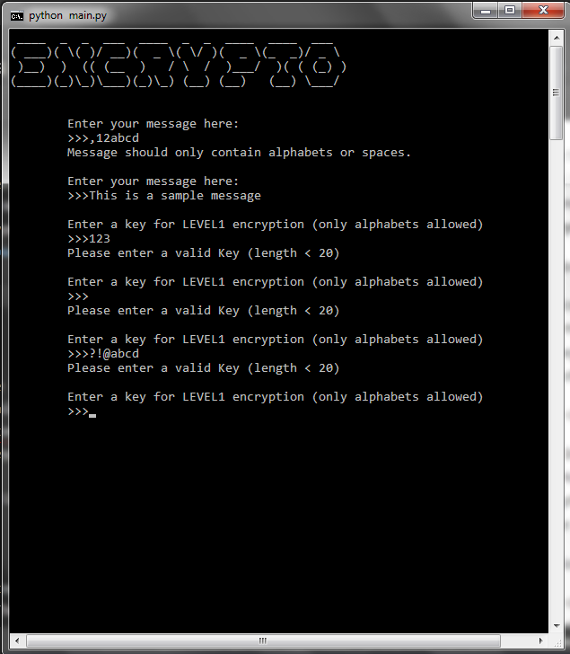

*Fig. 1.7 LEVEL1 Key Exceptions*

**Note: You might have noticed that the length being shown here is “20” whereas the length of the message “This is a sample message” is “24”. This is because Encrypt0 neglects the whitespaces during the encryption procedure in both the message and the LEVEL1 key.**

After typing a syntactically correct LEVEL1 key, you will see:

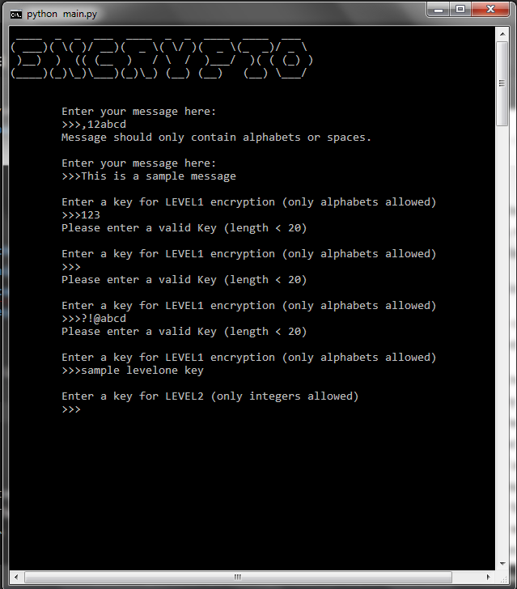

*Fig. 1.8 LEVEL2 Encryption*

In this prompt, you can enter any integral value between 0 and 26. (However, use of 0 or 26 is not recommended.) The prompt will keep on reappearing until a syntactically correct integer is typed:

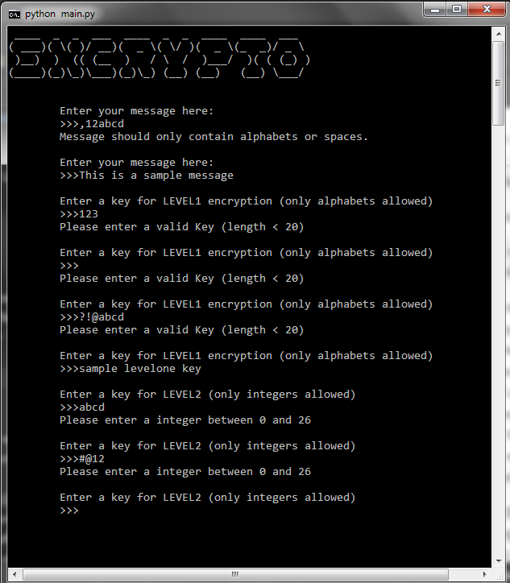

*Fig. 1.9 LEVEL2 Key Exceptions*

After typing a syntactically correct value in the LEVEL2 Key prompt, you will see the last requirement for encryption:

*Fig. 1.10 Filename Suffix (Encryption)*

This prompt is a little different. Here too, only integers (any value) are allowed. But, in order to maintain safety of your other encrypted data, this prompt will close the program if any other character than an integer is typed.

##### **WARNING:** This program does not check if a particular suffix has already been used. So, if for example, you had already stored an encrypted message in a file with suffix “1”, and you try to encrypt another message with the suffix “1” again, the previous file would be overwritten, and the encrypted data in that file may be corrupted.

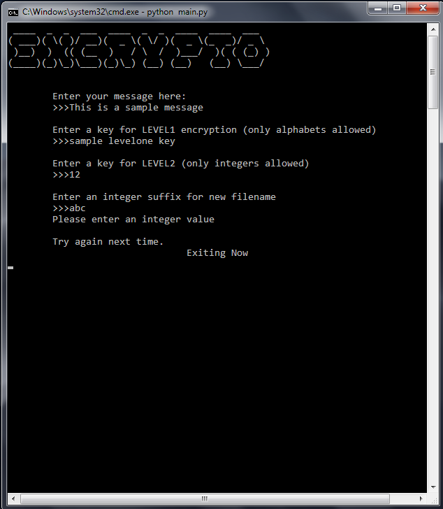

*Fig. 1.11 Suffix Exceptions (Encryption)*

As you can see in Fig. 1.11, the program closed after typing a non-integer value. However, if you type an already existing integral suffix value or a new integral suffix value, you will see:

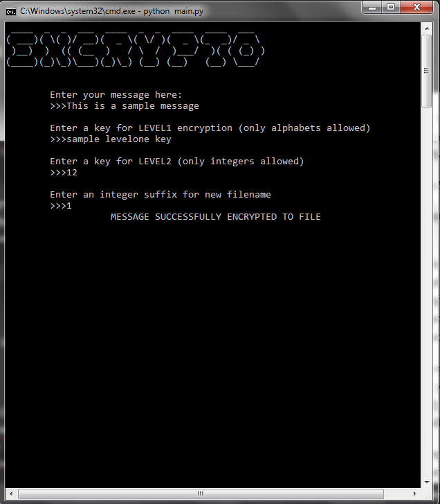

*Fig. 1.12 Encryption Process Ends*

Now, if you look in a file explorer, in your Encrypt0 directory, inside the user folder, you will see:

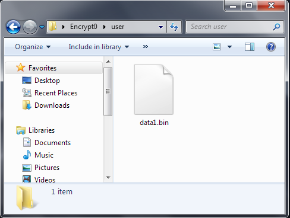

*Fig. 1.13 data{{suffix}}.bin*

So, this is a compressed binary (.bin) file which contains your encrypted message and other data. *(You might realise that the suffix you typed earlier, was used to name this file.)* Now, this file can be transported across devices, and decrypted using Encrypt0 on a different device too.

### II. Decrypt a message encrypted by Encrypt0:

After the Encryption process has ended, you will be returned back to the Main Dashboard (Fig. 1.2). Now, if you choose to decrypt, by pressing “2”, you will see a loading screen followed by:

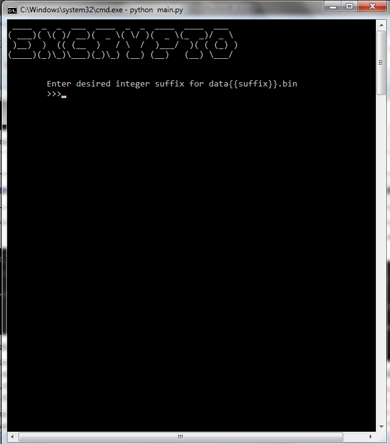

*Fig. 1.14 data{{suffix}}.bin Input (Decryption)*

**Note: For the sake of this documentation, the same encrypted file (data1.bin) will be used for decryption on the same device, with the same instance of the application, but, this process should work with any other device having Encrypt0 on it.**

As seen in Fig. 1.11, here too, to preserve file integrity, the correct suffix for data{{suffix}}.bin is required to continue with the execution of the application. Further, the typed suffix should also be already present in the “user” directory.

Also, the data{{suffix}}.bin file should not be tampered with, since doing so can give undesired results. For example, here, the file “data1.bin” was just created. Now, if the “user” directory was removed or a different suffix was give as input:

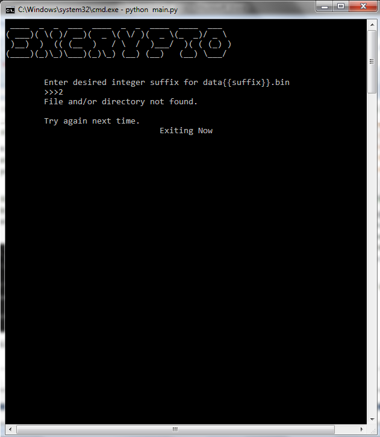

*Fig. 1.15 Encrypted File Suffix Input Exceptions*

However, if the input corresponds to an already-existing filename and the user directory is intact, then:

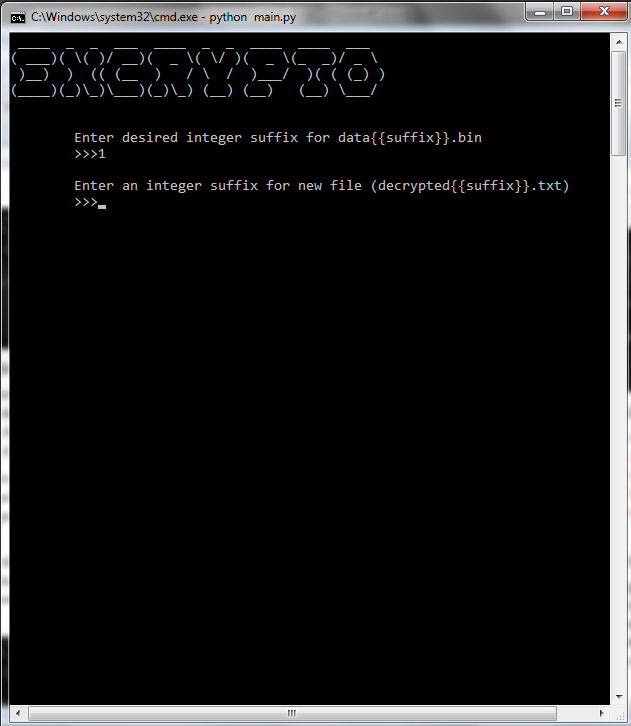

*Fig. 1.16 Suffix for decrypted{{suffix}}.txt*

##### WARNING: This program does not check if a particular suffix has already been used. So, if for example, you had already stored a decrypted message in a file with suffix “1”, and you try to decrypt another message, storing it in a file with the suffix “1” again, the previous file would be overwritten, and the decrypted data in that file may be corrupted.

So, carefully enter a new suffix for decrypted{{suffix}}.txt.
Note: The final output file, containing your decrypted message is the file “decrypted{{suffix}}.txt”. For example, if you chose to encrypt a message in a file called “data345.bin” and entered the values “345” and “456” in the two prompts one-by-one during decryption, your decrypted data from “data345.bin” will be stored into “decrypted456.txt”in the “user” directory.

For example, if I input “1” and “1” in the two prompts during decryption:

  

*Fig. 1.17 Decryption Process Ends*

In the “user” directory, you will see:

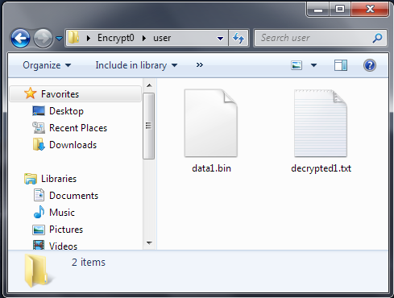

*Fig. 1.18 “user” Directory After Encryption & Decryption*

The file “decrypted1.txt” contains:

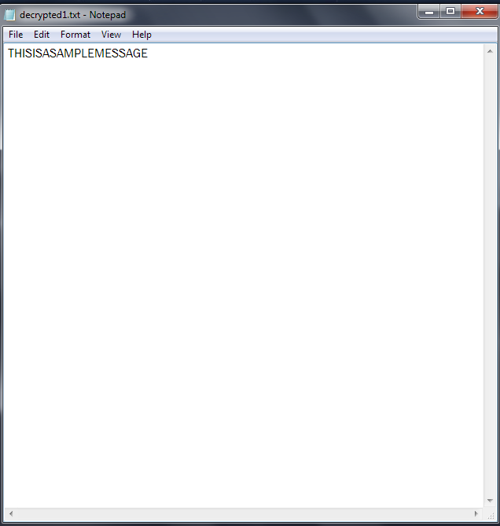

*Fig. 1.19 “decrypted345.txt”*

**Note: Encrypt0 does not preserve whitespaces in the encrypted and decrypted data as an added security measure.**

### III. Exit Program:

If you choose to exit Encrypt0 at any time when you are on the Main Dashboard, you can exit by typing “3” into the Main Dashboard prompt.

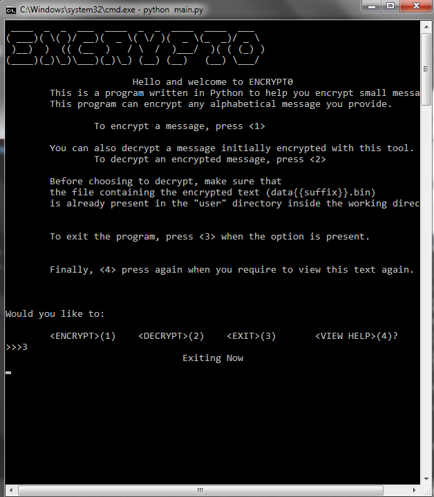

*Fig. 1.20 Exiting From Dashboard*

### IV. Viewing Help:

*Viewing Help*

Typing “4” on Main Dashboard will just display the Dashboard again:

##### ***This concludes the walkthrough of the various usages of Encrypt0.***

## LIMITATIONS

1. Although this application can be used to encrypt small messages, this level of encryption is NOT SECURE for sensitive data since Encrypt0 only uses a few levels of Classical Era ciphers for encryption.

2. Since Encrypt0 is based on Classical Era Ciphers, it does not add any functions to the fundamental working of those ciphers. Therefore, Encrypt0 can only encrypt alphabetical messages.

3. The file usage structure is rigid in Encrypt0. If not careful, previously encrypted files can get overwritten by the application (as warned earlier).

4. Finally, “KeyboardInterrupts” have not been handled to the fullest extent.

## FURTHER INFORMATION

1. The source code of the whole application is provided in the “source” folder. 
2. The Python Library named “PyInstaller” has been used to create the standalone frozen binary executable for Encrypt0.
3. To build the application yourself, refer to the https://github.com/TimeATronics/Encrypt0/releases/tag/v1.0 section.

### Bibliography

Matthes, E. (2019). Python Crash Course: A Hands-On, Project-Based Introduction to Programming 2nd edition. No Starch Press.

Sweigart, A. (2018). Cracking Codes with Python An Introduction to Building and Breaking Ciphers. No Starch Press.

Cryptography, P. (n.d.). Autokey Cipher. Retrieved January 2021, from Practical Cryptography: http://www.practicalcryptography.com/ciphers/autokey-cipher/

Cryptography, P. (n.d.). Caesar Cipher. Retrieved January 2021, from Practical Cryptography: http://www.practicalcryptography.com/ciphers/caesar-cipher/

GeeksForGeeks. (2020, May 10). Autokey Cipher | Symmetric Ciphers. Retrieved January 2021, from GeeksForGeeks: https://www.geeksforgeeks.org/autokey-cipher-symmetric-ciphers/

GeeksForGeeks. (2019, August 12). Caesar Cipher in Cryptography. Retrieved January 2021, from GeeksForGeeks: https://www.geeksforgeeks.org/caesar-cipher-in-cryptography/

Cestari, F. (2017, October 7). PyInstaller ImportError: No module named 'pyfiglet.fonts'. Retrieved January 2021, from Stack Overflow: https://stackoverflow.com/a/46615852

SuperShoot. (2019, March 31). How to use the try-except command in a while loop asking for user input. Retrieved January 2021, from Stack Overflow: https://stackoverflow.com/a/55437460

